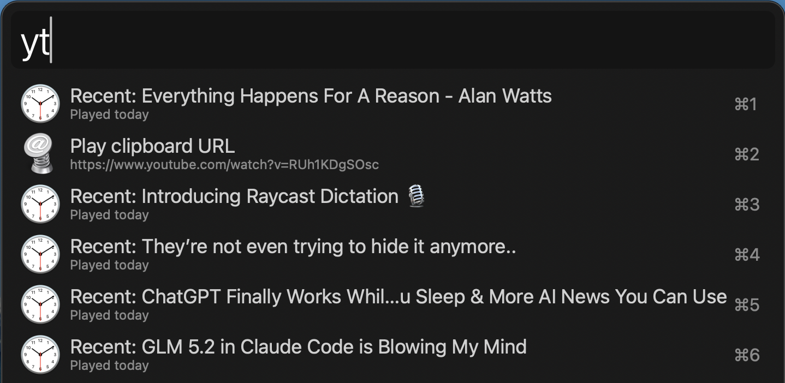
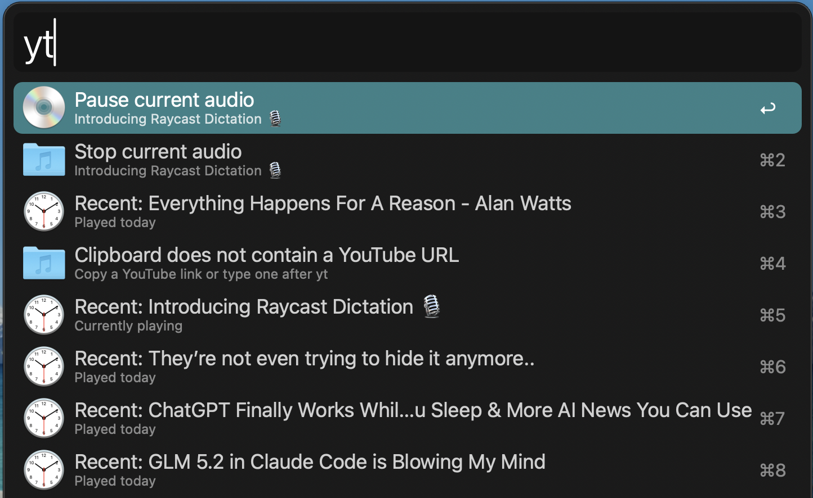

# Alfred YT Audio Player

Play YouTube links as background audio directly from Alfred on macOS using `yt-dlp` and `ffplay`, without keeping YouTube open in Chrome or any other browser.

Current public release: `v0.11.0`

Current development build: `v0.12.0`

This is an early public release. It works well in local testing, but it has not been fully tested across different macOS and Alfred setups yet. Feedback, bug reports, and edge cases are very welcome.

## What It Does

* Type `yt <youtube-url>` to play a YouTube video as audio from Alfred.
* Type `yt` with no URL to play the YouTube link currently in the clipboard.
* Play audio in the background without leaving YouTube open in a web browser.
* Stop the current audio automatically when a new item is played.
* Pause, resume, or stop playback from Alfred while audio is active.
* Choose a persistent Max, Medium, or Low audio level without changing the volume of other Mac apps.
* Reopen one of the last five videos you played from recent history, with shorter labels and per-video play counts.
* Surface up to three most-played videos first as quick picks when you open `yt`.
* See Alfred notifications when playback starts, pauses, resumes, stops, or fails.

## Why It Exists

This workflow is for people who already live in Alfred and want a fast way to:

* turn a YouTube URL into background audio
* listen to long videos, talks, interviews, or music without keeping a browser tab open
* switch between a fresh link, the clipboard, and recent history with minimal friction

## Screenshots

Search results with clipboard playback and recent history:



Active playback controls inside Alfred:



## Release Notes

The unreleased `v0.12.0` development build adds workflow-specific audio levels:

* type `yt volume` and choose Max (100%), Medium (55%), or Low (25%)
* keep that choice as the default for future playback
* leave macOS system volume and audio from other apps unchanged
* use Max by default for backward-compatible playback

The selected level takes effect when the next item starts. Changing the volume of an already-running `ffplay` session would require restarting playback or moving to a player with live control support.

`v0.11.0` improves first-glance playback selection inside Alfred.

Highlights:

* surface up to three most-played videos first as quick picks
* replace `Quick Pick:` and `Recent:` title prefixes with icon-only categorization
* refresh playback and action icons with a more modern custom visual style
* keep the same Alfred-first playback, clipboard, history, and background-audio workflow

Known caveat:

* this release is still not fully tested on every macOS, Alfred, Python, or `ffplay` setup yet

## Requirements

* Alfred with Powerpack
* macOS
* `yt-dlp`
* `ffplay`
* `python3`

The workflow now runs `python3` from `PATH`, so standard Homebrew or system Python setups should work on both Intel and Apple Silicon Macs as long as `python3` is available in Alfred's shell environment.

## Supported URL Formats

The workflow currently accepts common YouTube link formats including:

* `https://www.youtube.com/watch?v=...`
* `https://youtu.be/...`
* `https://www.youtube.com/shorts/...`
* `https://www.youtube.com/live/...`

## Repo Layout

* `workflow/`
  Contains the Alfred workflow source, including `info.plist` and the Python script Alfred runs.
* `tests/`
  Contains unit tests for URL parsing, history handling, and Script Filter behavior.
* `scripts/package_workflow.sh`
  Packages the `workflow/` directory into an `.alfredworkflow` file in `dist/`.

## Install

1. Run:

```zsh
./scripts/package_workflow.sh
```

2. Open the generated file:

`dist/YT Audio Player.alfredworkflow`

3. Import it into Alfred.

For the easiest install path after publishing, download the latest `.alfredworkflow` file from the GitHub Releases page and open it directly.

## Usage

* `yt https://www.youtube.com/watch?v=...`
* `yt https://youtu.be/...`
* `yt`
* `yt volume`

When you type only `yt`, Alfred shows:

* playback controls first when audio is already active
* `Play clipboard URL` if the clipboard contains a valid YouTube URL
* the current audio level, with Max, Medium, and Low available through `yt volume`
* up to three most-played videos first as quick picks
* the five most recent videos underneath
* simplified recent-item names when the original YouTube title is noisy
* how many times each recent video has been played

## State Storage

The workflow stores runtime state in Alfred's workflow data directory:

* `state.json`
  Tracks the active playback PID, URL, title, and start time
* `history.json`
  Tracks the five most recent unique plays, simplified recent-item labels, and per-video play counts
* `settings.json`
  Stores the selected Max, Medium, or Low audio level

The workflow bundle also includes custom icon assets used to distinguish quick picks, recent items, playback controls, and warning states visually inside Alfred.

## Known Limits

* v1 only supports YouTube URLs
* pause and resume are process-level controls built on `ffplay`, so very occasional stream reconnection quirks may still need a fresh play action
* audio-level changes apply to the next playback because `ffplay` does not expose reliable live volume control for this background process
* error handling is surfaced through Alfred result rows and script failures rather than a custom UI

## Ideal GitHub Topics

If you publish this repo on GitHub, these topics are a good fit:

* `alfred-workflow`
* `alfred`
* `youtube`
* `youtube-audio`
* `yt-dlp`
* `ffplay`
* `macos`
* `productivity`

## Feedback

If you try this workflow and hit a bug, confusing interaction, or compatibility issue, feedback is welcome. The most useful reports include:

* your macOS version
* your Alfred version
* whether `yt-dlp` and `ffplay` are installed through Homebrew or another method
* the Alfred debug log lines around the failing action

## Keywords

Search terms for discoverability:

* Alfred workflow
* Alfred YouTube player
* Alfred YouTube audio
* Alfred audio player
* Alfred background audio
* Alfred clipboard workflow
* yt-dlp Alfred
* ffplay Alfred
* macOS YouTube audio player
* YouTube audio workflow
* Play YouTube audio from Alfred
* Listen to YouTube in Alfred
* Play YouTube without browser
* Background YouTube audio on macOS
* Alfred media control
* Alfred recent history workflow
